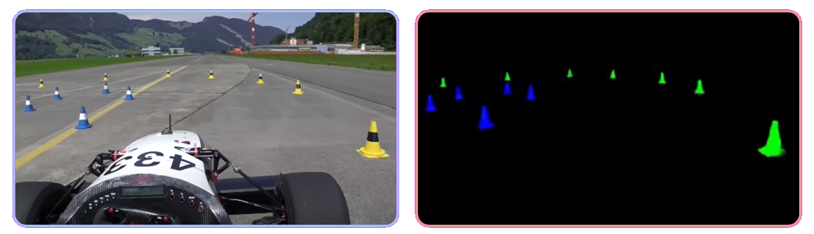

# Image-based autonomous driving system for an e-fsae

Image-based self-driving algorithm, fully trained in simulation and capable of commanding a vehicle around an unknown track delimited by cones. 

  

The following work implements two Neural Networks in tandem, a first one which creates a semantic segmentation and pixel-wise depth estimation of the input image; and a second one, which based on the semantic segmentation outputs the respective vehicle command.

For a more detailed explanation, see the full [thesis](thesis.pdf).

## Semantic Segmentation and Depth Estimation
To mitigate the existing sim-to-real visual gap, a U-Net is trained to create a segmentation of the cones present in the scene. This converts the current image (belonging to either the real or the simulation domain), into a common simplified domain. To accomplish this, a technique known as Domain Randomization was used.

- Sim-to-real gap

- Dataset example (Domain Randomization)

### Results
The performance of the U-Net over an image belonging to the real domain is shown below.

- [ Input ](https://www.youtube.com/watch?v=FbKLE7uar9Y) (real domain) and segmentation (simplified domain): 

- Semantic segmentation of a virtual top view of the input image (point-cloud), created with the pixel-wise depth estimation.

  

- Semantic segmentation and depth estimation of different scenes.

## Driving policy
The driving network was trained via Behavioral Cloning (Imitation Learning), with a dataset created using the Gazebo simulator.

### Results
The performance of the network, over new simulated tracks can be seen below.

## Prototype

